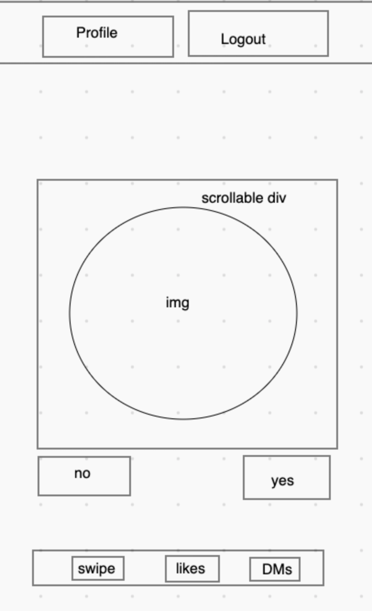
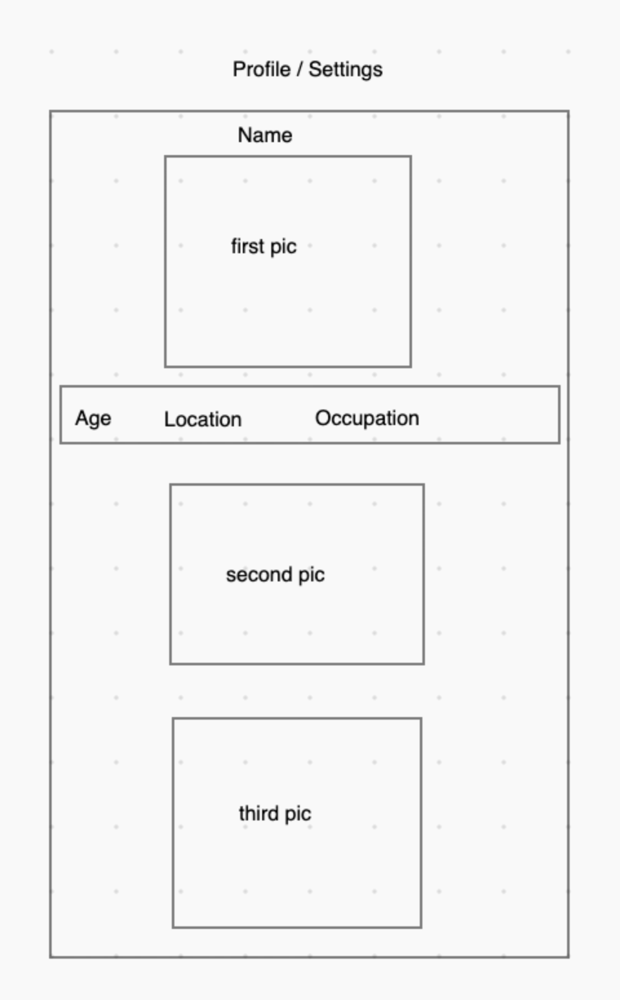
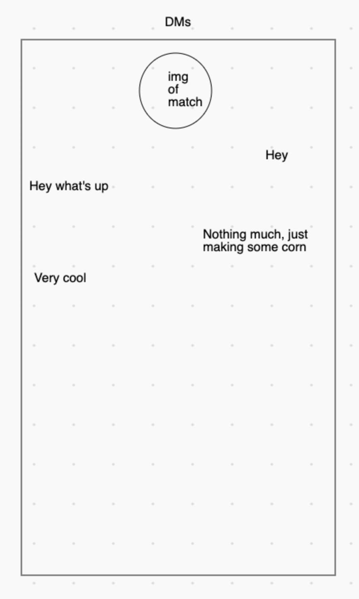

# Dating App

A dating app designed to encourage healthy conversation where users can register and look for matches based on the set criteria. Once a user has created an account and logged in, they will be immediately welcomed to the main page where there is a randomized user from the database that fits their preferences criteria. The user can click 'yes' or 'no' to either notify that person or to simply move on to the next person. Once they find a match the request is made to chat.

## User Stories
As a user, I want to be able to sign up with my age, gender, bio, location and search preferences to filter my results.

As a user I want to be able to look for matches and message the people that I find. I want to be able to accept or deny a messaging request. 

As a user I should not receive more than one message from the match until I respond. I want to be able to access my message history.

As a user, I want to be able to like someone's profile to notify them that I want to chat.

As a user, I want to be able to edit my profile pictures and information.

## Wireframes
### Main

### Profile / Settings

### Direct messages
